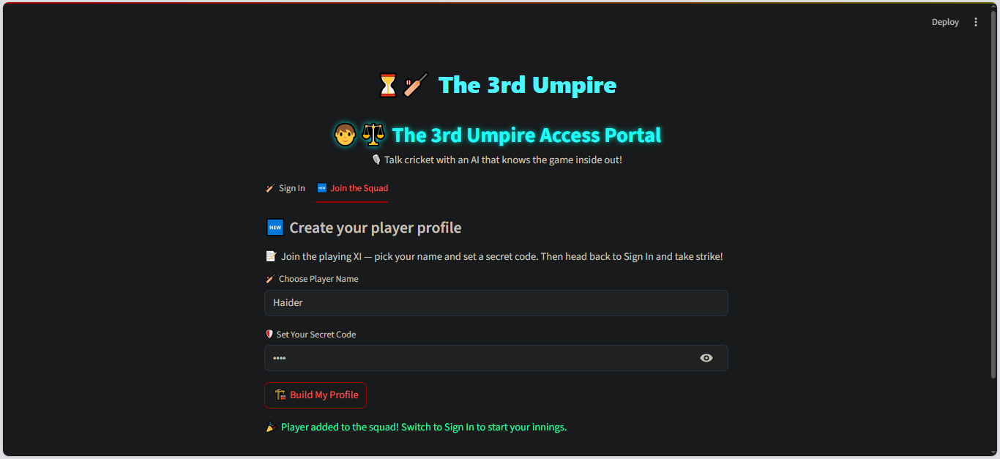
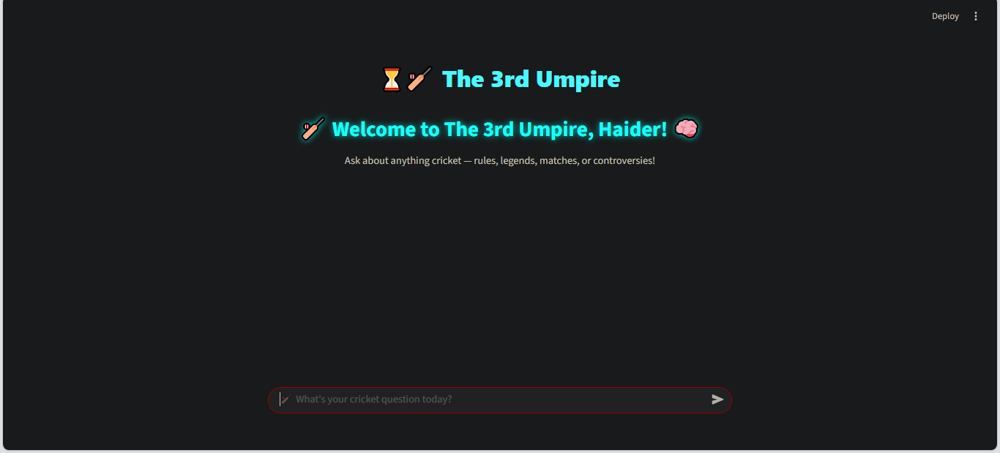
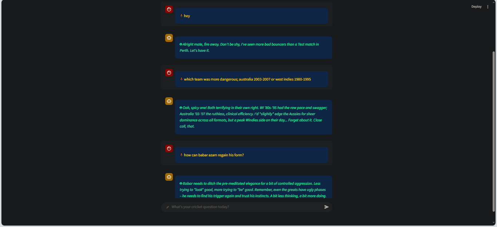

# 🤖 The 3rd Umpire: Streamlit + LangChain Simple Conversational Cricket Agent

An AI-powered cricket companion that talks like your witty cricket-nerd friend.
Ask about rules, legends, stats, controversies, or match moments — it replies with sharp, punchy insights.

Built with **LangChain**, **Gemini 1.5 Flash**, **Streamlit**, and **SQLite** for conversation history.

Check out the live app here 👉 [The 3rd Umpire](https://langchain-cricket-agent-6uyrhlnfmsubmautps2v3d.streamlit.app/)

---

## 📖 Introduction

This app is your interactive 3rd umpire — not for no-balls, but for every cricket question you’ve ever had.
It combines Google’s **Gemini AI** with a slick Streamlit UI and a simple database for user login & chat history.

You can:

- 🏏 Chat about cricket’s rules, tactics, and trivia.
- 📜 Save your entire conversation history.
- 👤 Create an account and log back in anytime.
- 🎭 Enjoy a themed, fun chat experience with typing animations.

---

## 🛠️ Technologies Used

- **Python 3.9+**
- `Streamlit` — frontend chat interface.
- `LangChain` — prompt handling & chat history.
- `Google Generative AI (Gemini 1.5 Flash)` — cricket brain.
- `SQLite3` — local database for users & conversations.
- `dotenv` — environment variable management.

---

## 🗂️ Folder Structure

```bash
the-3rd-umpire/
├── app.py            # Streamlit UI & app flow
├── chat_agent.py     # Gemini AI + LangChain logic
├── db.py             # SQLite DB functions
├── requirements.txt  # Dependencies
├── .env              # API key storage
└── README.md         # Documentation
```
---

## ⚙️ Environment Setup

1. **Clone the repo**
```bash
git clone https://github.com/haidersjaf77/langchain-cricket-agent.git
cd the-3rd-umpire
```

2.**Install dependencies**
```bash
pip install -r requirements.txt
```

3.**Create `.env` file in the root folder:**
```bash
GOOGLE_API_KEY=your_google_api_key_here
```
🔑 Get your API key from: Google AI Studio

4.**Run the app**
```bash
streamlit run app.py
```
---

## 🎯 How It Works

- **User Auth** — `db.py` handles signup/login with SQLite.
- **AI Chat** — `chat_agent.py` connects LangChain prompt with Gemini AI.
- **UI & Flow** — `app.py` builds the themed chat experience with typing effects and saved history.

---

## 📸 Preview

### 🆕 Signup


### 🔐 Login


### 💬 Chat Interface


### 🗣️ Demo
